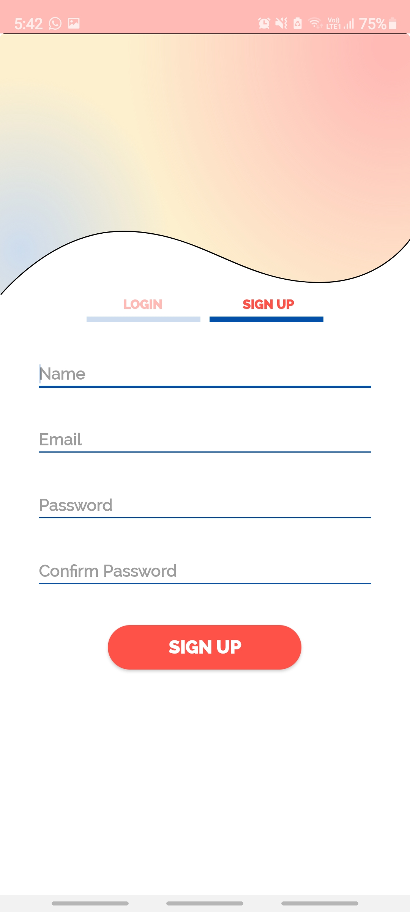
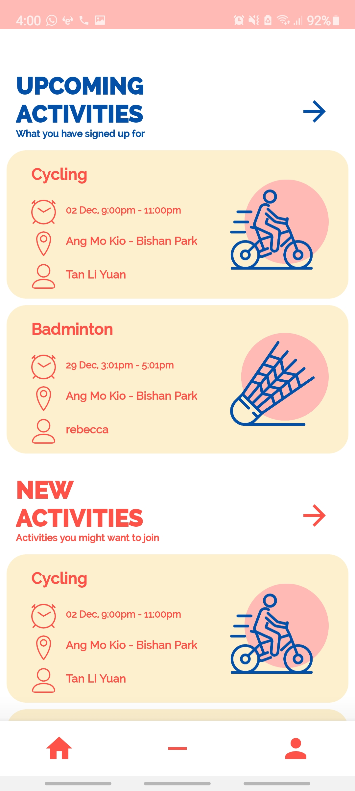
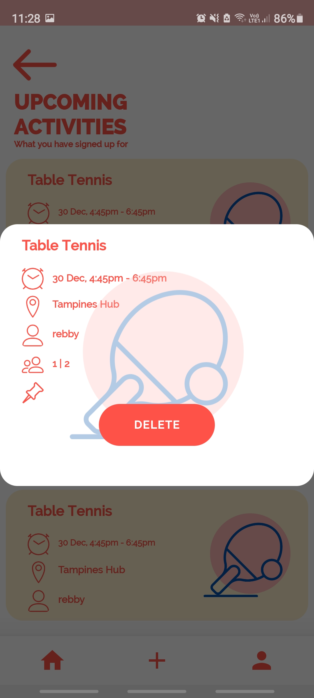
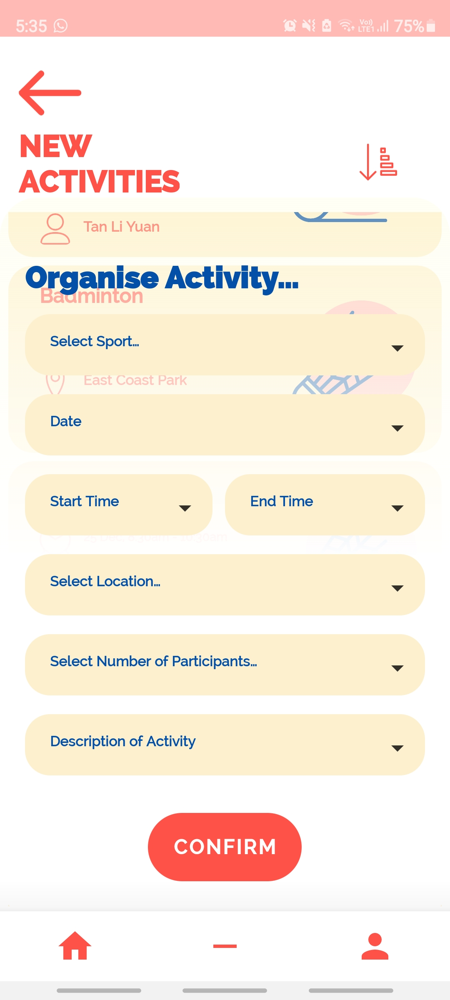

# App Package Outline

#Decription
PUG draws inspiration from the kampung spirit in Singapore, fostering a community that plays together. Organising and joining events is streamlined and can be done in the snap of a finger. You can view and sort the activities that you have signed up for, organised or previously participated by accessing them in one click from the home page. Other key features include filters to sort events by date, sport and location for when joining events as well as a customisable profile.

*Do refer to the newest releases for bug fixes to the application

 

   

<a href="https://miro.com/app/board/o9J_lddUdVk=/" title="Design Patterns (Miro)">
Design Patterns (Miro) </a>
 
<a href="https://www.figma.com/proto/Lf8xJDSLl2WVLb3frxfqZE/50.001-1D-Wireframe?node-id=1:2&viewport=286,312,0.5&scaling=scale-down">
App Designs (Figma)</a>

## Commit 
2 activities: AuthActivity + MainActivity 
10 fragments: GetStartedFragment, LoginFragment, RegisterFragment, ResetFragment 
BookingFragment, NewActFragment, UpcomingActFragment, MainFragment 
EditProfileFragment, UserFragment

Packages 
### tech.sutd.pickupgame 
#### constant
> ClickState

#### data
> *ui*
> > *helper*
> > * Various database helper methods
> >
> > *new_activity* 
> > *past_activity* 
> > *upcoming_activity* 
> > *user* 
> > *your_activity*
> > * room database codes
> 
> > *worker*
> > * All the worker tasks for various databases
>
> > *AppDataManager*
> > * Concrete class that implements the AppDataManager methods
> > 
> > *AppExecutors*
> > * Custom executor codes
> >
> > *AppSchedulerProvider*
> > * Concrete class that stores custom RxJava Scheduler Threads
> >
> > *DataManager*
> > * Extends all methods from other databases using interfaces
> 
> > *Resource*
> > * RxJava enums & base observer setters
> 
> > *SchedulerProvider*
> > * Methods to retrieve RxJava Scheduler Threads

#### di
> Refer to Design Patterns (Miro)

#### models
> *ui* 
> >
> > BookingActivity 
> > * Data class for pushing to firebase realtime db + firestore
> >
> > NewActivity 
> > PastActivity 
> > UpcomingActivity 
> > YourActivity 
> > * Data class for inserting, updating, deleting, custom querying in Room
> 
> User 
> * Data class for inserting, updating, deleting, custom querying in Room
> 
> UserProfile
> * Data class for reading from and writing to firebase realtime db

### ui

> *auth*
> > *gettingstarted* 
> > GetStartedFragment
>
> > *login* 
> > LoginFragment
>
> > *register* 
> > RegisterFragment
>
> > *reset* 
> > ResetFragment
>
> > *viewmodel* 
> > UserViewModel
> > * firebase realtime db + firebaseAuth writes and reads: register, reset, updateUserDetail, login, insertUserDb
> > * room methods: insert, deleteAllUsers, getUsers
> 
> AuthActivity
> 
> *main*
> > *booking* 
> > BookingFragment 
> >
> > *main*
> > > *adapter* 
> > > FilterAdapter (ListAdapter)  
> > > * NewActivity db filter
> > >
> > > NewActivityAdapter (PagedListAdapter)  
> > > * Coupled to NewActFragment + MainFragment
> > >
> > > PastActivityAdapter (RecyclerAdapter) 
> > > * Coupled to UpcomingActFragment
> > >
> > > UpcomingActivityAdapter (PagedListAdapter) 
> > > * Coupled to UpcomingActFragment + MainFragment
> > >
> > > YourActivityAdapter (RecyclerAdapter)
> > > * Coupled to UpcomingActFragment
> >
> > > *newact* 
> > > NewActFragment
> >
> > > *upcomingact* 
> > > UpcomingActFragment
> >
> > > *viewmodel* 
> > > BookingActViewModel 
> > > * push to realtime db
> > >
> > > NewActViewModel 
> > > * room method: insert, deleteById, deleteByChecked (check if registered, delete from NewActivity db), deleteByClock (delete old data), 
> > > getAllNewActivitiesByClock, getAllNewActivitiesBySport, getAllNewActivitiesByClock2 (filter)
> > > * firebase realtime db + firestore read & write data: pull, push
> > >
> > > PastActViewModel 
> > > * room method: insert, getPastActivities
> > > * firebase realtime db: pullFrom("upcoming_activity", "your_activity")
> > >
> > > UpcomingActViewModel 
> > > * room method: insert, deleteByClock, deleteById, getAllUpcomingActivitiesByClock, getAllUpcomingActivitiesByClock2 (filter)
> > > * firebase realtime db + firestore read & write data: deleteFromDb, pull
> > > 
> > > YourActViewModel 
> > > * room method: insert, deleteById, getAllYourActivitiesByClockLimit10, getAllYourActivitiesByClock
> > > * firebase realtime db + firestore read & write data: deleteFromDb, pull
> > > 
> > MainFragment
> >
> > *user*
> > > *editprofile* 
> > > EditProfileFragment
> >
> > UserFragment 
> >
> > BaseInterface 
> > * Custom interfaces for listeners
> >     * BookingActListener
> >     * UpcomingActDeleteListener
> >     * RefreshListener
> 
> > MainActivity
> >
> > BaseViewModel
> > * Retrieve instances of CompositeDisposable, DataManager, SchedulerProvider

### util

> CustomSnapHelper
> * For recyclerview snaps
> 
> DateConverter
> * For date & time conversion
> 
> StringChecker
> * Checks strings & returns images / adapts strings
> 
> TextInputEditTextNoAutofill
> * Override autofill

### viewmodels

> ViewModelProviderFactory
> * Refer to Design Patterns (Miro), required for di

### Package
> BaseActivity
>
> BaseApplication
> * inject application component into BaseApplication
>
> BaseFragment
> * retrieves navController, disableAutoFill, setDialog, enqueueing task (for refresh)
> 
> SessionManager
> * used to keep track of auth status of user (register, login, logout, user instance)

### androidTest
> Instrumented testing cases using JUnit4Runner + Espresso

### test
> Unit testing cases using JUnit4 + Regex
